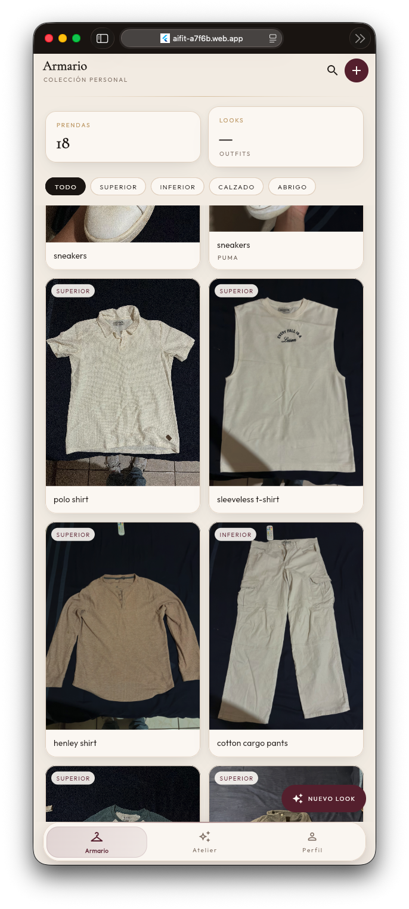
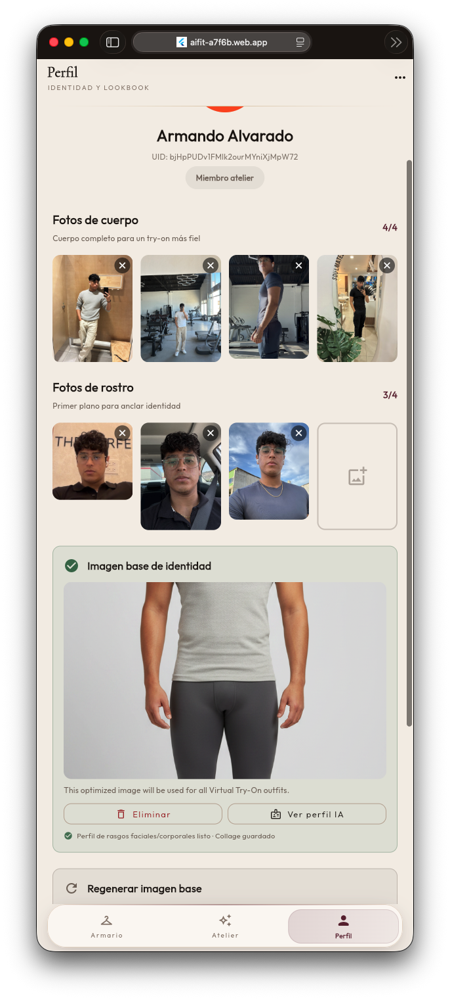
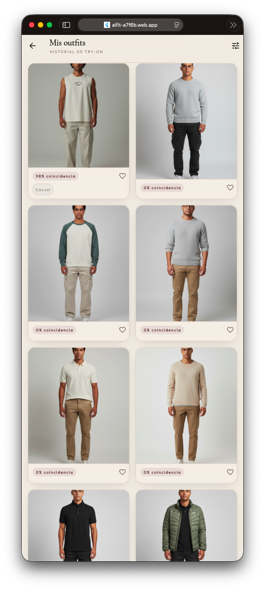
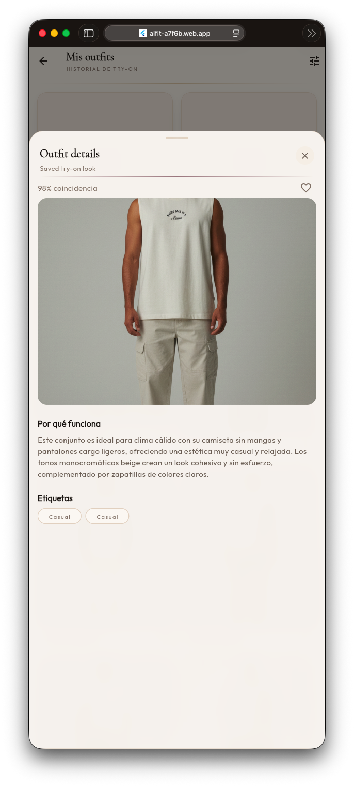
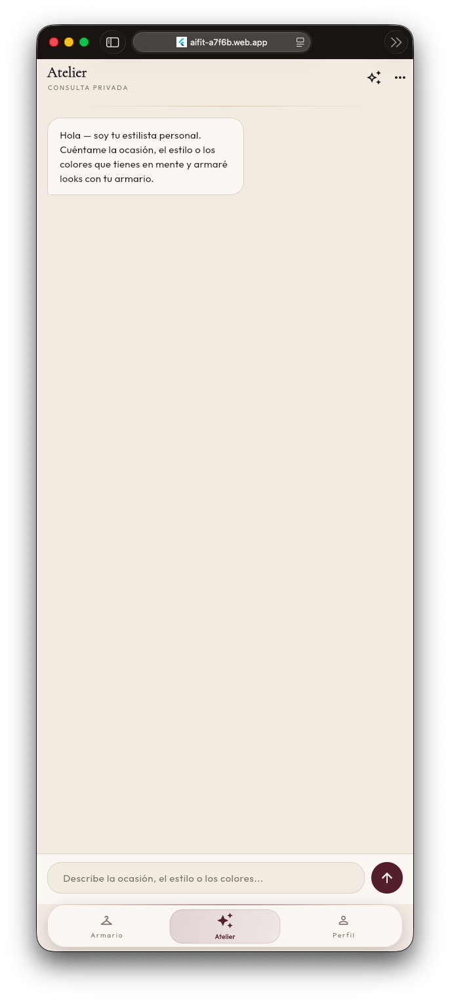
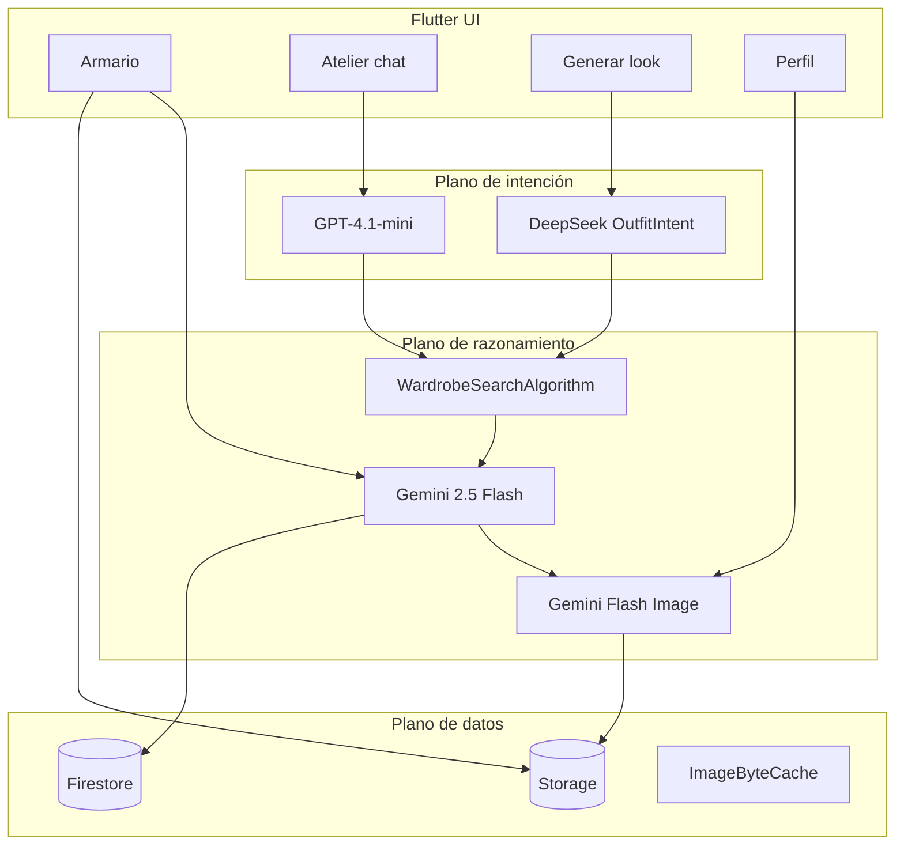

# AIFit — Atelier de moda con IA

AIFit convierte el armario real de una persona en un **grafo semántico de prendas** y genera looks personalizados con try-on virtual. No recomienda catálogo: trabaja con lo que ya tienes.

Este README documenta las **tecnologías**, cómo se **da contexto a los modelos** y se **comprimen las imágenes**, los **modelos de outfit**, y la **arquitectura / organización de carpetas**.

---

## Capturas de producto

App en [https://aifit-a7f6b.web.app](https://aifit-a7f6b.web.app)

<table>
  <tr>
    <td align="center" valign="top" width="50%">
      <p><strong>Armario</strong></p>
      
    </td>
    <td align="center" valign="top" width="50%">
      <p><strong>Perfil e identidad</strong></p>
      
    </td>
  </tr>
  <tr>
    <td align="center" valign="top" width="50%">
      <p><strong>Historial de try-on</strong></p>
      
    </td>
    <td align="center" valign="top" width="50%">
      <p><strong>Detalle de look</strong></p>
      
    </td>
  </tr>
  <tr>
    <td colspan="2" align="center">
      <p><strong>Atelier</strong></p>
      
    </td>
  </tr>
</table>

---

## Tecnologías

### Cliente

| Tecnología | Uso en AIFit |
|------------|----------------|
| **Flutter / Dart** | App multiplataforma (iOS, Android, Web). El cliente orquesta IA, Storage y Firestore. |
| **BLoC + flutter_bloc** | Estado por feature: `AuthBloc`, `WardrobeBloc`, `ChatBloc`, `OutfitGenerationBloc`, `SavedOutfitsBloc`. |
| **go_router** | Rutas, splash, onboarding y shell de navegación (Armario / Atelier / Perfil). |
| **google_fonts** | Identidad visual: *Cormorant Garamond* (editorial) + *Outfit* (UI). |
| **cached_network_image / Dio** | Carga de fotos de prendas, try-on e identidad. |
| **image + Dart `compute()`** | Compresión JPEG fuera del hilo de UI (en web se evita el isolate por el coste de copiar buffers). |
| **get_it / equatable** | Inyección ligera y comparación de estados. |

### Cloud (Firebase / Google Cloud)

| Servicio | Rol |
|----------|-----|
| **Firebase Authentication** | Google Sign-In. El `uid` aísla todos los datos. |
| **Cloud Firestore** (`aifitdbex`) | `users`, `wardrobe_items`, `saved_outfits`. |
| **Firebase Storage** | Originales de prendas, fotos de identidad, collage, imagen base y try-on. |
| **Firebase AI SDK → Vertex AI** | Todas las llamadas a Gemini (análisis, composición, imagen). |
| **Firebase Hosting** | Deploy de `flutter build web`. |

### IA externa

| Proveedor | Modelo | Dónde |
|-----------|--------|--------|
| OpenAI | `gpt-4.1-mini` | Chat del atelier (`StylistChatService`) |
| DeepSeek | `deepseek-chat` | Intent estructurado (`OutfitIntentAnalyzer`) |
| Vertex / Gemini | `gemini-2.5-flash` | Análisis de prenda + composición de outfits |
| Vertex / Gemini | `gemini-2.5-pro` | Perfil de identidad a partir del collage |
| Vertex / Gemini | `gemini-2.5-flash-image` | Imagen base + try-on virtual |

---

## Cómo damos contexto a los modelos (y por qué funciona)

Ningún modelo ve “toda la app”. Cada etapa recibe **solo el contexto que necesita**, en el formato que mejor razona: texto estructurado, JSON de armario o bytes de imagen.

```
Foto de prenda  →  Gemini Flash (visión)  →  metadata v2 en Firestore
Chat natural    →  GPT-4.1-mini           →  StylistIntentState
Prompt / intent →  DeepSeek (JSON)        →  OutfitIntent
Armario filtrado + fotos JPEG             →  Gemini Flash multimodal  →  3 looks
Identidad (collage + perfil) + prendas    →  Gemini Flash Image       →  try-on
```

### 1. Contexto del armario (semántica, no solo “camiseta azul”)

Al subir una prenda, Gemini analiza la foto con un prompt de estilista profesional (`WardrobeAnalysisPrompt`) y devuelve JSON v2:

- Tipo / subtipo, colores de paleta cerrada, estilo, temporada
- Peso visual, textura, silueta, estética
- Scores (formalidad, lujo, streetwear…)
- Vectores de ocasión y clima

Eso se guarda en Firestore. Más adelante, el ranking local (`WardrobeSearchAlgorithm` + `WardrobeMetadataScorer`) **prefiltra** el closet (máx. 10 prendas por tipo) para no mandar 50 fotos al modelo.

### 2. Contexto de intención (qué quiere vestir la persona)

El chat no improvisa el outfit. GPT acumula un `StylistIntentState` (ocasión, paleta, formalidad, vibe, restricciones). Cuando hay suficiente señal, se genera un `OutfitIntent` JSON (DeepSeek, temperatura 0.2). Si el chat ya trae intent, **se omite DeepSeek**.

Ese JSON se traduce a `OutfitSemanticTargets` y se inyecta en el prompt de composición.

### 3. Contexto visual para componer el look

`OutfitGeneratorService` no describe las prendas de memoria: **descarga hasta 12 JPEGs** del armario filtrado, las comprime y las envía a Gemini 2.5 Flash junto con:

- El intent estructurado
- Un bloque de texto con metadata de cada prenda (id, tipo, colores, scores)

Gemini responde 3 outfits JSON (ids, explicación, match). La UI pinta los looks **antes** del try-on (entrega progresiva).

### 4. Contexto de identidad (que el try-on sea *tú*)

El try-on no usa un maniquí genérico. El pipeline de identidad:

1. Fotos de cara y cuerpo (hasta 4 + 4)
2. Collage local (`IdentityPhotoCollage`)
3. Gemini 2.5 Pro extrae `IdentityProfile` (tono de piel, rostro, pelo, cuerpo)
4. Gemini Flash Image genera una **imagen base** reutilizable (`baseImageUrl`)
5. Cada try-on manda: imagen base + ancla de cara + prendas del look + bloques de `IdentityConsistencyPrompt` (misma persona, mismo tono, mismas proporciones)

La consistencia de identidad tiene prioridad sobre el “look editorial”.

---

## Compresión de imágenes (calidad vs. tokens vs. latencia)

Las fotos originales se guardan en Storage. Lo que viaja a los modelos se **preprocesa en el cliente** (`ImageCompressionUtil`) para no pagar tokens de visión con megapíxeles innecesarios.

| Payload | Ancho | JPEG | Para qué |
|---------|-------|------|----------|
| **Garment** | máx. **768 px** | calidad **82** | Análisis de prenda y composición multimodal. Suficiente para tela, color y silueta; recorta coste y latencia. |
| **Identity** | mín. **1024 px** (upscale si viene más chica) | calidad **93** | Cara y cuerpo: no se puede perder detalle de identidad. |
| **Raw** | sin tocar | — | Casos donde el original ya es el payload. |

Detalles de ingeniería:

- **Móvil/desktop:** `compute()` (isolate) para decode/resize/encode.
- **Web:** se evita el isolate (copiar `Uint8List` al worker jankea WASM); se cede un frame y se encodea en el isolate de UI.
- Concurrencia: 5 descargas en nativo, 2 en web (`ImagePipelineConfig`).
- Caché de sesión (`ImageByteCache`) para no re-descargar la misma prenda en un mismo generate.
- Tope de **12 imágenes** por request multimodal.

Resultado: el modelo ve prendas nítidas y un rostro fiel, sin mandar HEIC de 8 MB.

---

## Modelos que definen los outfits

La composición de un look es un **pipeline de 4 fases**, no un único prompt.

| Fase | Modelo | Qué decide |
|------|--------|------------|
| **0 — Conversación** | `gpt-4.1-mini` | Diálogo natural, aclara ocasión/estilo, emite `readyToGenerate`. |
| **1 — Intent** | `deepseek-chat` (fallback `gemini-2.5-flash`) | JSON `OutfitIntent`: ocasión, paleta, formalidad, clima, restricciones. |
| **2 — Filtro local** | Algoritmo Dart (sin IA) | Recorta el armario por metadata v2 + scores. Control de coste y combinatoria. |
| **3 — Composición** | `gemini-2.5-flash` multimodal | Ve las prendas, elige 3 combinaciones, explica el look, da `%` de match. |
| **4 — Try-on** | `gemini-2.5-flash-image` | Sintetiza la foto con identidad bloqueada + prendas del outfit. |

**Por qué no un solo modelo**

- GPT es mejor en conversación incremental.
- DeepSeek es barato y estable en JSON a baja temperatura.
- Gemini Flash ve la prenda (textura, caída, color) y razona el conjunto.
- Flash Image es la modalidad de **salida de imagen**.
- Gemini Pro se reserva para el perfil de identidad (visión de mayor fidelidad, una vez por usuario).

Los outfits se persisten en `saved_outfits` (try-on en background) para el lookbook personal.

---

## Arquitectura

```
Cliente Flutter (BLoC)  →  Auth / Firestore / Storage
                        →  OpenAI + DeepSeek (REST)
                        →  Firebase AI SDK → Vertex (Gemini)
```

Capas por feature (clean-ish):

- **presentation** — páginas, widgets, BLoC
- **domain** — modelos, prompts, paletas
- **data** — repositorios Firestore/Storage
- **services** — orquestación de IA (solo en features que la necesitan)

El cliente **es el runtime de orquestación**. Las Cloud Functions del repo son samples; el flujo de producción corre en Dart.



---

## Organización de carpetas

```
lib/
  main.dart                          # Bootstrap Firebase + BLoCs + tema Atelier
  firebase_options.dart
  core/
    theme/                           # Color, tipografía, ThemeData
    widgets/                         # Shell, nav, cards, empty states, router
    services/                        # Firestore, Storage, Gemini, DeepSeek
    utils/                           # Compresión, collage, pool, config de pipeline
    constants/                       # IdentityConsistencyPrompt
    l10n/                            # Copy en español
    platform/                        # Imagen web vs IO
  features/
    auth/          presentation + data     Login, welcome, photos de onboarding
    wardrobe/      presentation/domain/data  Closet, análisis de prenda
    stylist/       presentation/domain/data/services  Chat atelier
    outfit/        presentation/domain/data/services  Intent, ranking, generate, try-on
    profile/       presentation/domain/data/services  Identidad e imagen base
    simulation/    presentation                  Resultado lookbook

functions/                           # Samples Genkit (no es el path de producción)
docs/images/                         # Capturas de producto
web/                                 # index.html, manifest PWA
android/ ios/                        # Hosts nativos
```

Tokens de diseño Atelier (`lib/core/theme/`):

- Lienzo pergamino `#F3EEE6`, tinta espresso, burgundy `#5C2433`, champagne `#C4A574`
- Display: Cormorant Garamond · UI: Outfit

---

## Desarrollo local

```bash
flutter pub get
flutter run -d chrome
# o
flutter run
```

Requiere proyecto Firebase `aifit-a7f6b`, Vertex AI habilitado y claves de OpenAI / DeepSeek según `lib/api_keys.dart` / configuración del entorno.

## Deploy web

```bash
flutter build web --release
firebase deploy --only hosting
```

Hosting sirve `build/web` con rewrite SPA a `index.html`.

**Producción:** [https://aifit-a7f6b.web.app](https://aifit-a7f6b.web.app)
