# AIFit — Technical Cloud & AI Architecture

**Document classification:** Internal technical architecture  
**Audience:** Engineering leadership, investors, AI platform stakeholders  
**Version:** 1.0  
**Platform:** AIFit (`aifit-a7f6b`) — AI-native personalized fashion intelligence

---

## Table of Contents

1. [Executive Overview](#1-executive-overview)
2. [Technology Stack](#2-technology-stack)
3. [Full Data Flow](#3-full-data-flow)
4. [Wardrobe Intelligence System](#4-wardrobe-intelligence-system)
5. [AI Orchestration Pipeline](#5-ai-orchestration-pipeline)
6. [Ranking & Compatibility Algorithms](#6-ranking--compatibility-algorithms)
7. [Virtual Try-On System](#7-virtual-try-on-system)
8. [Performance Engineering](#8-performance-engineering)
9. [Cloud Architecture](#9-cloud-architecture)
10. [Key Technical Differentiators](#10-key-technical-differentiators)
11. [Future Roadmap](#11-future-roadmap)

---

## 1. Executive Overview

### What AIFit Is

AIFit is an **AI-native fashion intelligence platform** that transforms a user's physical wardrobe into a **semantically enriched, queryable fashion graph** and uses **multimodal AI orchestration** to generate personalized outfit recommendations and photorealistic virtual try-on visualizations.

Unlike catalog-based styling apps that recommend products to buy, AIFit operates on **owned garments**—each item is analyzed, classified, and stored with deep semantic metadata that powers downstream reasoning, ranking, and visualization.

### The Core AI Problem

Personalized outfit generation from a real wardrobe is technically difficult for four compounding reasons:

| Challenge | Why It Matters |
|-----------|----------------|
| **Combinatorial explosion** | A wardrobe of 50 items yields millions of valid combinations; brute-force or naive LLM prompting is infeasible. |
| **Multimodal grounding** | Fashion reasoning requires *seeing* garments—texture, silhouette, color temperature, and visual weight cannot be inferred from text labels alone. |
| **Intent ambiguity** | User requests like "something elegant for a summer dinner" must be decomposed into structured constraints (occasion, formality, palette, climate, aesthetic). |
| **Identity consistency** | Virtual try-on must preserve skin tone, body proportions, and facial structure across generations—a problem distinct from outfit selection. |

### Why Multimodal AI Orchestration Is Required

No single model excels at all stages of the pipeline. AIFit uses a **specialized multi-model architecture**:

- **Conversational intent** (natural dialogue, incremental clarification)
- **Structured semantic extraction** (JSON schema fidelity, low temperature)
- **Deterministic pre-filtering** (cost control, latency, explainability)
- **Multimodal outfit reasoning** (vision + structured wardrobe context)
- **Image generation** (identity-aware try-on synthesis)

This is not a chatbot with a fashion skin—it is a **production AI orchestration system** with explicit phases, fallbacks, caching, and progressive delivery.

### Platform Capabilities

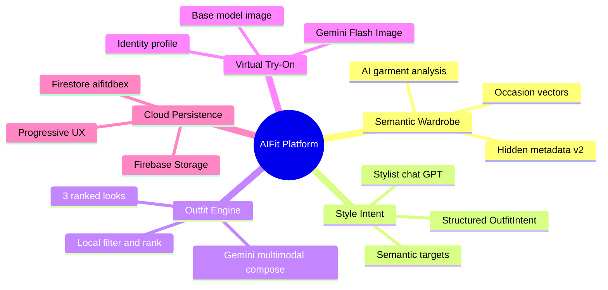

The platform:

- **Understands clothing semantically** — each garment receives AI-enriched metadata at ingest (texture, silhouette, aesthetic vectors, occasion scores).
- **Understands user style intent** — conversational and structured intent layers capture occasion, palette, formality, vibe, and constraints.
- **Generates ranked outfits** — hybrid local algorithms + Gemini multimodal reasoning produce scored, explained outfit combinations.
- **Creates virtual try-on visualizations** — identity-aware prompting with user body/face profiles and cached base model images.
- **Personalizes outputs** — identity profiles, semantic targets, and session intent flow through every generation stage.

---

## 2. Technology Stack

### Architecture Layers

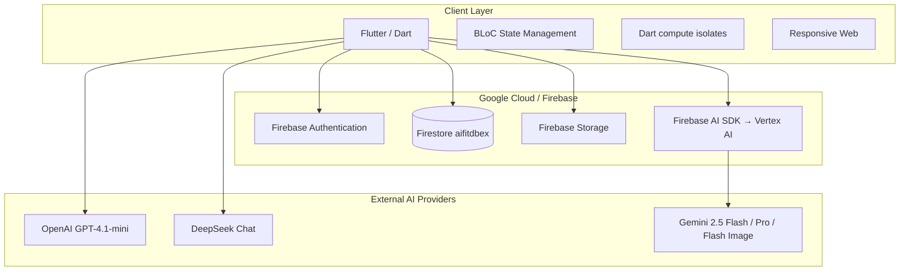

### Frontend (Delivery Layer)

| Technology | Role in AIFit |
|------------|---------------|
| **Flutter** | Cross-platform client (iOS, Android, Web); hosts orchestration BLoCs and service layer. |
| **BLoC** | `ChatBloc`, `OutfitGenerationBloc` — phase-aware async state, progressive try-on status per outfit. |
| **Dart `compute()` isolates** | Off-main-thread JPEG resize/encode for garment and identity images (`ImageCompressionUtil`). |
| **Responsive web** | Adaptive layouts; Google Sign-In popup/redirect flows for web sessions. |

> **Scope note:** The client is the **orchestration runtime** for cloud AI today. Server-side functions exist as samples (`functions/src/genkit-sample.ts`) but production flows execute from the Flutter service layer via Firebase AI SDK and direct REST APIs.

### Cloud Infrastructure

| Service | Configuration | Purpose |
|---------|---------------|---------|
| **Firebase Authentication** | Google Sign-In | User identity; UID scopes all data |
| **Cloud Firestore** | Database ID: `aifitdbex` | `users`, `wardrobe_items`, `saved_outfits` |
| **Firebase Storage** | `aifit-a7f6b.firebasestorage.app` | Photos, wardrobe originals, try-on outputs, identity collages |
| **Firebase AI SDK** | `firebase_ai` → **Vertex AI** | All Gemini calls (no separate API key in client for Gemini) |
| **Security Rules** | `firestore.rules`, `storage.rules` | Owner-scoped access on `userId` / path prefix |

### AI Providers — Model Selection Rationale

| Provider | Model | Primary Use | Why This Model |
|----------|-------|-------------|----------------|
| **OpenAI** | `gpt-4.1-mini` | Stylist chat (`StylistChatService`) | Optimized for **conversational UX**: natural dialogue, incremental intent gathering, bilingual assistant messages, JSON-structured turn output. Low latency for interactive chat. |
| **DeepSeek** | `deepseek-chat` | Outfit intent structuring (`OutfitIntentAnalyzer`) | Optimized for **structured JSON extraction** at low temperature (0.2); cost-efficient Phase 1 when chat does not supply precomputed intent. |
| **Vertex AI / Gemini** | `gemini-2.5-flash` | Wardrobe analysis, intent fallback, outfit generation | Optimized for **multimodal reasoning** and JSON mode; processes up to 12 garment images + prompts in a single request. |
| **Vertex AI / Gemini** | `gemini-2.5-pro` | User identity analysis from photo collage | Higher-fidelity vision reasoning for **facial structure, skin tone, body type** metadata. |
| **Vertex AI / Gemini** | `gemini-2.5-flash-image` | Base model image + virtual try-on | **Image-out modality** for photorealistic synthesis; identity-aware try-on generation. |

### Dependency Summary

```
firebase_ai ^3.12.1    → Vertex AI Gemini
cloud_firestore        → aifitdbex
firebase_storage       → user-scoped assets
firebase_auth          → Google provider
http                   → OpenAI + DeepSeek REST
```

---

## 3. Full Data Flow

### End-to-End User Journey

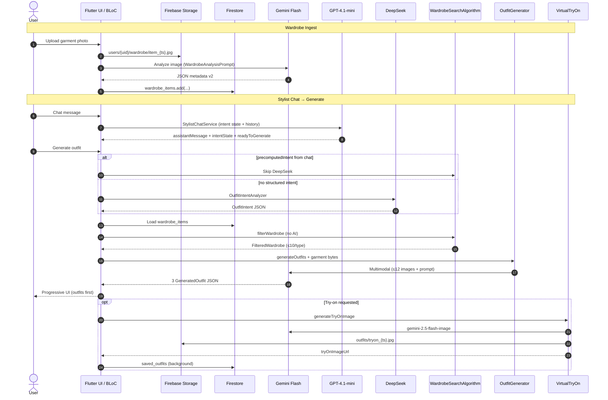

### Step-by-Step Flow Reference

| Step | Action | Data Movement | Sync/Async |
|------|--------|---------------|------------|
| **1** | User uploads wardrobe item | `File` → Storage `users/{uid}/wardrobe/` | Async upload |
| **2** | AI analyzes garment | Storage URL → Gemini (`analyzeImageToJson`) | Async (~2–5s) |
| **3** | Semantic metadata generated | Gemini JSON → `WardrobeAiMetadata` v2 | Sync parse |
| **4** | Metadata stored in Firestore | `wardrobe_items` document (flattened snake_case fields) | Async write |
| **5** | User interacts with stylist chat | Messages in BLoC memory (no Firestore chat collection) | Sync UI |
| **6** | GPT conversational layer | `StylistIntentState` + last 8 turns → OpenAI REST | Async per message |
| **7** | DeepSeek semantic structuring | `userPrompt` → `OutfitIntent` (skipped if chat precomputed) | Async Phase 1 |
| **8** | Local ranking/filter | Full wardrobe → `FilteredWardrobe` (max 10/type) | Sync (Dart) |
| **9** | Gemini multimodal reasoning | ≤12 compressed JPEGs + intent prompt → outfit JSON array | Async Phase 3 |
| **10** | Outfit generation | `GeneratedOutfit[]` with IDs, scores, explanations | Async |
| **11** | Virtual try-on | Base/body/face + garments → image bytes → Storage | Async Phase 4 (lazy) |
| **12** | Storage + persistence | `saved_outfits`, `tryOnImageUrl` updates | `unawaited` background |
| **13** | Progressive rendering | BLoC emits outfits → then per-outfit `TryOnStatus` | Streaming UX |

### Data Plane vs Control Plane

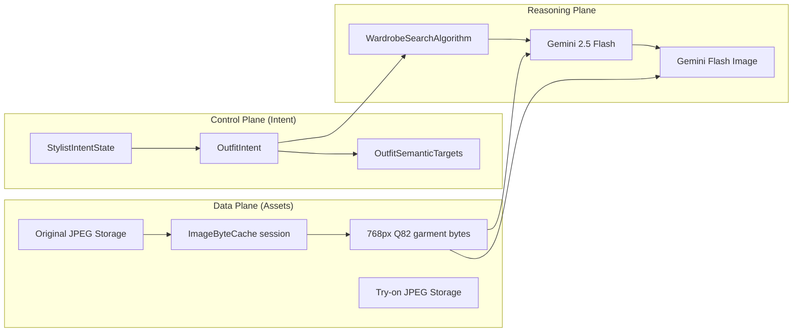

### Where Compression, Caching, and Multimodal Payloads Occur

| Stage | Compression | Cache | Multimodal Construction |
|-------|-------------|-------|-------------------------|
| Wardrobe ingest | Gemini receives garment-compressed bytes via `AiImagePayload.garment` | — | Single image + JSON prompt |
| Outfit generation | `ImageByteCache.getOrCompressGarment` (768px, Q82) | URL-keyed session cache | Up to 12 `InlineDataPart` + `TextPart` last |
| Virtual try-on | Identity Q93 / garment Q82 | Reuses cache from outfit gen | Base/body/face → garments → text prompt |
| Identity analysis | Collage 1024×2048 @ Q93 | Firestore `identityProfile` | Collage + JSON prompt → `gemini-2.5-pro` |

---

## 4. Wardrobe Intelligence System

### Design Philosophy

Traditional wardrobe apps store **shallow labels** (`type`, `color`, `brand`). AIFit stores a **dual-layer model**:

1. **Visible fields** — human-readable tags for UI and simple matching.
2. **Hidden semantic metadata (schema v2)** — machine-oriented fashion intelligence used by scoring algorithms and multimodal prompts.

This separation enables **human-like outfit reasoning** without exposing complexity to the user.

### Ingest Pipeline

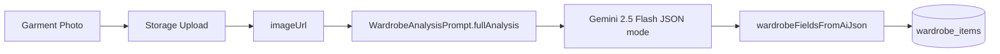

**Service:** `WardrobeRepositoryImpl` → `FirebaseAIServiceImpl.analyzeImageToJson`  
**Prompt:** `WardrobeAnalysisPrompt` — fashion stylist, fabric analyst, silhouette expert, color theory, aesthetic classifier.

### Visible Metadata (User-Facing)

```json
{
  "type": "top",
  "subType": "linen shirt",
  "colors": ["beige", "navy"],
  "styleTags": ["casual", "minimalist"],
  "season": ["spring", "summer"],
  "brand": "optional"
}
```

Canonical values enforced via `WardrobePalette` (controlled vocabulary prevents embedding drift).

### Hidden Semantic Metadata (Schema v2)

Stored **flattened** on the Firestore document (snake_case keys):

```json
{
  "ai_schema_version": 2,
  "visual_weight": "light",
  "texture": {
    "primary": "linen",
    "secondary": ["cotton_blend"],
    "surface_feel": "breathable",
    "structure": "relaxed_weave"
  },
  "silhouette": {
    "fit": "relaxed",
    "length": "regular",
    "shape": "straight"
  },
  "fashion_aesthetic": {
    "primary": "quiet_luxury",
    "secondary": ["old_money", "minimalist"],
    "confidence": 0.88
  },
  "color_profile": {
    "temperature": "warm",
    "saturation": "muted",
    "contrast": "low"
  },
  "style_scores": {
    "formality": 0.45,
    "streetwear": 0.10,
    "luxury": 0.72,
    "minimalist": 0.80,
    "sporty": 0.05,
    "vintage": 0.15
  },
  "gender_expression": {
    "primary": "unisex",
    "confidence": 0.75
  },
  "layering_compatibility": {
    "works_with": ["structured_blazer", "wool_coat"],
    "avoid_with": ["heavy_puffer", "technical_shell"]
  },
  "occasion_vectors": {
    "office": 0.55,
    "beach_dinner": 0.70,
    "formal_event": 0.35,
    "everyday": 0.85
  },
  "climate_compatibility": {
    "hot_weather": 0.90,
    "humid_weather": 0.75,
    "cold_weather": 0.15
  },
  "visual_attributes": {
    "cleanliness": 0.85,
    "sharpness": 0.40,
    "casualness": 0.80,
    "elegance": 0.65
  }
}
```

### Semantic Dimensions Explained

| Dimension | Function in System |
|-----------|-------------------|
| **Texture** | Layering and season compatibility; prevents pairing heavy wool with linen in hot weather contexts. |
| **Silhouette** | Proportion reasoning (relaxed top + slim bottom balance). |
| **Fashion aesthetic** | Aligns items to user intent slugs (`old_money`, `quiet_luxury`, `streetwear`). |
| **Visual weight** | Prevents visual imbalance (all heavy or all light garments). |
| **Occasion vectors** | Continuous scores per occasion slug—powers `WardrobeMetadataScorer` boost. |
| **Style scores** | Multi-axis formality/luxury/sporty spectrum for intent matching. |
| **Layering compatibility** | Explicit works_with / avoid_with for outerwear decisions. |
| **Color profile** | Temperature/saturation/contrast beyond discrete color names. |
| **Climate compatibility** | Weather-aware filtering when intent includes climate keys. |

### Why This Enables Better AI Outfit Generation

1. **Pre-Gemini filtering** — `WardrobeMetadataScorer` adds up to **+0.35 relevance boost** before multimodal calls, shrinking token payloads.
2. **Richer Gemini context** — Filtered items carry semantics that images alone may not convey at small resolutions.
3. **Explainable ranking** — Scores decompose into occasion, aesthetic, color, and constraint components.
4. **Human-like reasoning** — Mimics how stylists think: occasion → formality → palette → texture → silhouette.

---

## 5. AI Orchestration Pipeline

### Orchestration Philosophy

AIFit rejects **monolithic single-model** architectures. Each model operates at its **comparative advantage** in a staged pipeline with explicit contracts between phases.

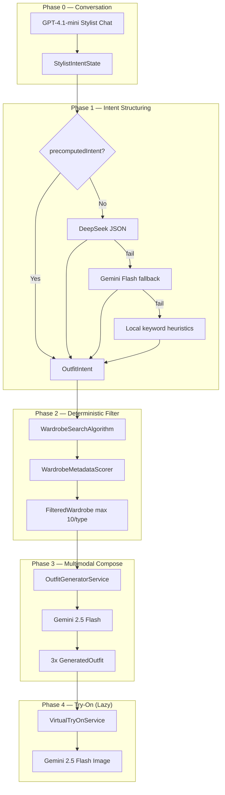

### Phase Responsibilities

| Phase | Component | Model | Input → Output |
|-------|-----------|-------|----------------|
| **0** | `StylistChatService` | GPT-4.1-mini | User message + intent state → `StylistChatResponse` |
| **1** | `OutfitIntentAnalyzer` | DeepSeek → Gemini → local | Natural language → `OutfitIntent` |
| **2** | `WardrobeSearchAlgorithm` | None (Dart) | Wardrobe + intent → `FilteredWardrobe` |
| **3** | `OutfitGeneratorService` | Gemini 2.5 Flash | Images + intent → `List<GeneratedOutfit>` |
| **4** | `VirtualTryOnService` | Gemini 2.5 Flash Image | Identity + garments → Storage URL |

**Orchestrator:** `OutfitService` — coordinates phases, caches try-on context, fires background Firestore saves.

### Chat Path Optimization

When the user generates from stylist chat with sufficient structure:

```dart
precomputedIntent: chatIntent.hasStructuredIntentForPipeline
    ? chatIntent.toOutfitIntent()
    : null
```

**DeepSeek is skipped** — GPT's accumulated `StylistIntentState` maps directly to `OutfitIntent`. This reduces latency and API cost for the primary user flow.

### Why Orchestration Beats Single-Model / Naive Prompting

| Approach | Limitation | AIFit Solution |
|----------|------------|----------------|
| **Single model for everything** | Poor at conversation *and* JSON schema *and* image gen; high cost per request | Specialized models per phase |
| **Naive prompting** | Sends entire wardrobe to LLM; $$$$ tokens; slow | Local filter reduces to ≤40 items, ≤12 images |
| **Text-only systems** | Cannot see actual garment colors, patterns, wear | Multimodal Gemini with compressed images |
| **Synchronous try-on** | Blocks UI 15–30s | Progressive P1: outfits first, try-on lazy per card |

### Intent Data Contract (`OutfitIntent`)

```json
{
  "reasoning": "Summer dinner, elevated casual, warm neutrals",
  "occasion": "date",
  "preferredColors": ["beige", "white"],
  "styleTags": ["elegant", "minimalist"],
  "season": "summer",
  "weather": "warm",
  "constraints": {
    "mustInclude": "linen pants",
    "mustAvoid": "sneakers",
    "budget": null
  },
  "userPrompt": "original user text",
  "semanticTargets": {
    "occasionSlugs": ["beach_dinner", "summer_date"],
    "aestheticSlugs": ["quiet_luxury"],
    "climateKeys": ["hot_weather"],
    "formality": 0.65
  }
}
```

---

## 6. Ranking & Compatibility Algorithms

### Hybrid AI + Local Algorithms

Phase 2 is **entirely local** (no API calls). This is a deliberate architectural decision:

> **Hybrid AI + algorithmic ranking is faster, cheaper, and more explainable than asking an LLM to score every wardrobe item.**

### Scoring Pipeline

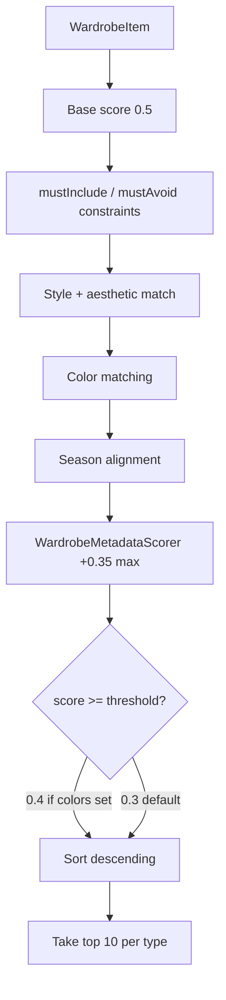

### Relevance Score Components (`WardrobeSearchAlgorithm`)

| Signal | Behavior |
|--------|----------|
| **Base score** | 0.5 starting point |
| **mustInclude** | Hard exclude (score 0) or +0.2–0.3 boost when color/type match |
| **mustAvoid** | Immediate exclusion (score 0) |
| **Style tags** | +0.2 base + 0.1 per match (max 3); opposite-style penalty −0.2 |
| **Preferred colors** | +0.3 proportional match; −0.35 penalty on mismatch |
| **Season** | Alignment boost when intent specifies season |
| **Metadata boost** | `WardrobeMetadataScorer.scoreMetadata` → 0.0–0.35 |

### Metadata Scorer Breakdown (`WardrobeMetadataScorer`)

| Sub-score | Max Contribution | Logic |
|-----------|------------------|-------|
| Occasion vectors | 0.12 | Best match among `semanticTargets.occasionSlugs` |
| Style scores (formality) | 0.08 | `1 - |item_formality - target_formality|` |
| Aesthetic alignment | 0.04 per slug | Maps aesthetics to style_score keys |
| Climate | variable | `climate_compatibility` vs intent climate keys |
| Color profile | variable | Temperature/saturation vs targets |

Items **without** `ai_schema_version: 2` metadata receive **zero metadata boost**—incentivizing re-analysis of legacy items.

### Compatibility Helper

`calculateCompatibility(item1, item2)` provides pairwise scoring for future features (outfit completion, swap suggestions). Not on the critical path for initial generation.

### Output Contract: `FilteredWardrobe`

```
tops:      ≤ 10 items (highest relevance)
bottoms:   ≤ 10 items
shoes:     ≤ 10 items
outerwear: ≤ 10 items
```

Maximum theoretical combinatorial space sent to Gemini: **10 × 10 × 10 × 10** — but Gemini receives **at most 12 garment images** selected across types for multimodal context.

---

## 7. Virtual Try-On System

### Problem Statement

Virtual try-on is among the hardest problems in fashion AI:

- **Identity consistency** — skin tone, face shape, and body proportions must remain stable across generations.
- **Garment fidelity** — clothing must resemble the user's actual items, not generic catalog renders.
- **Pose and lighting** — generated images must look plausible, not uncanny.

AIFit addresses this with a **multi-stage identity pipeline** before per-outfit try-on.

### Identity Pipeline

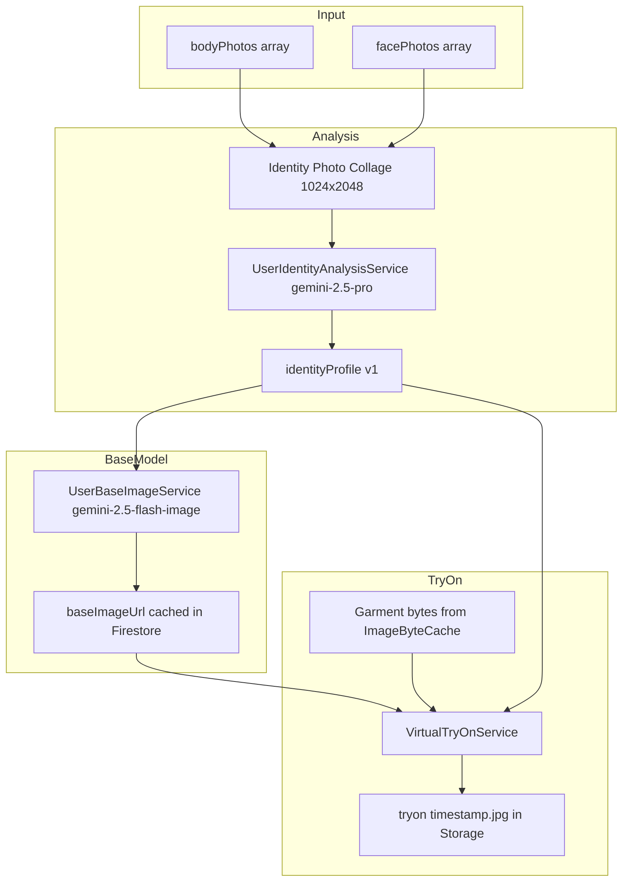

### Identity Profile Schema

```json
{
  "identity_version": 1,
  "skin_tone": {
    "primary": "medium_warm",
    "undertone": "golden",
    "confidence": 0.92
  },
  "face": {
    "shape": "oval",
    "jaw_definition": "moderate",
    "eye_shape": "almond",
    "nose_shape": "straight"
  },
  "hair": {
    "color": "dark_brown",
    "style": "short_textured",
    "density": "medium"
  },
  "body": {
    "type": "athletic",
    "height_estimate": "average",
    "shoulder_width": "medium",
    "build": "lean",
    "proportions": "balanced"
  },
  "visual_characteristics": {
    "contrast_level": "medium",
    "facial_sharpness": "moderate",
    "overall_presence": "confident"
  }
}
```

### Identity-Aware Prompting

`IdentityConsistencyPrompt.buildTryOnBlock(identityProfile)` injects a structured text block into the try-on prompt, specifying:

- Skin tone and undertone preservation
- Face shape and feature consistency
- Hair color, style, density
- Body type, build, proportions
- Explicit instructions to avoid identity drift

### Try-On Request Assembly (`VirtualTryOnService`)

**Model:** `gemini-2.5-flash-image` with `responseModalities: [ResponseModalities.image]`

**Image order in multimodal payload:**

1. User base image (`baseImageUrl`) **OR** body photo + face photo (compressed, identity quality)
2. Garment JPEGs (from `ImageByteCache`, max 768px, Q82)
3. Text prompt (identity block + outfit description + safety-tuned fashion instructions)

**Output:** Upload to `users/{uid}/outfits/tryon_{timestamp}.jpg`

### Why User Metadata Improves Consistency

| Without identity profile | With identity profile |
|------------------------|----------------------|
| Model hallucinates body type | Grounded proportions from analysis |
| Skin tone drifts between generations | Explicit undertone constraints |
| Generic face in try-on | Face structure locked via collage + text |
| Inconsistent hair | Hair metadata enforced in prompt |

### Progressive Try-On UX (P1)

| Outfit Index | Initial `TryOnStatus` | Behavior |
|--------------|----------------------|----------|
| 0 | `generating` (if enabled) | Auto-starts try-on after outfits render |
| 1, 2 | `readyForTryOn` | User taps to trigger lazy generation |
| Any | `ready` / `failed` | Per-outfit state in BLoC maps |

This **decouples outfit reasoning latency from image generation latency**—users see styled combinations in seconds, try-on loads progressively.

---

## 8. Performance Engineering

### Optimization Strategy Overview

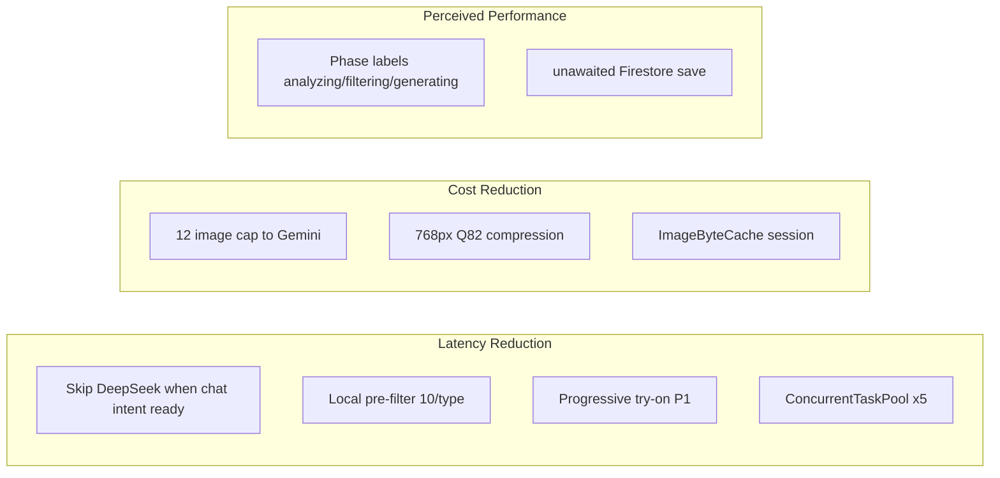

### Image Compression (`ImageCompressionUtil`)

| Payload | Max Width | JPEG Quality | Use Case |
|---------|-----------|--------------|----------|
| `garment` | 768px (downscale if larger) | 82 | Wardrobe + outfit + try-on garments |
| `identity` | 1024px min (upscale if smaller) | 93 | Face/body/collage for identity |
| `raw` | No processing | — | Passthrough when needed |

Compression runs in **Dart isolates** via `compute()` — keeps UI thread responsive during batch preparation.

### Image Byte Cache (`ImageByteCache`)

- **Scope:** Process-lifetime singleton (`ImageByteCache.instance`)
- **Keys:** Firebase Storage download URLs
- **Layers:** `_rawBytes` (network download once) → `_aiReadyBytes` (compressed once)
- **Parallelism:** `prepareGarmentImages` uses `ConcurrentTaskPool.mapConcurrent` (default **5** workers)

**Impact:** Outfit generation and try-on for the same garments **reuse bytes** — eliminates duplicate downloads and recompression within a session.

### Concurrent Task Pool

```dart
ConcurrentTaskPool.defaultConcurrency = 5
```

Bounded worker pool for parallel garment downloads. Failures return `null` at index without failing the entire batch.

### Multimodal Payload Reduction

| Technique | Limit | Rationale |
|-----------|-------|-----------|
| Wardrobe filter cap | 10 items / type | Reduces combinatorial noise before Gemini |
| Outfit generation cap | 12 images max | Token and latency ceiling |
| Images-before-text ordering | Gemini best practice | Improves multimodal attention |
| JSON response mode | `application/json` | Eliminates markdown parsing overhead |
| Temperature tuning | 0.2 intent / 0.3 outfits | Balance creativity vs determinism |

### Async Orchestration Patterns

| Pattern | Implementation |
|---------|----------------|
| **Background Firestore save** | `unawaited(_saveOutfitsToFirestore(...))` after Phase 3 |
| **Try-on context cache** | `OutfitService._cachedTryOnContext` per userId |
| **Base image reuse** | `UserBaseImageService` skips generation if `baseImageUrl` exists |
| **Phase UI delays** | 50–80ms between analyzing → filtering → generating labels |

### Progressive Loading States

**`OutfitGenerationBloc` / `ChatBloc`:**

```
analyzing → filtering → generating → [outfits visible] → try-on per card
```

**`TryOnStatus` enum:** `none` | `readyForTryOn` | `generating` | `ready` | `failed`

### Latency Impact Summary

| Optimization | Estimated Impact |
|--------------|------------------|
| Skip DeepSeek (chat path) | −1–3s Phase 1 |
| Local filter (no LLM) | −$0.01+ per request, −2–5s vs full-wardrobe prompt |
| 12-image cap + compression | −40–60% multimodal payload size |
| ImageByteCache | −50%+ repeat download time on try-on |
| Lazy try-on | −10–20s perceived wait on initial render |

### AI-Ready Assets

AIFit does **not** persist separate "AI-ready" Storage objects. Instead:

- **Original** stored at `users/{uid}/wardrobe/item_{ts}.jpg`
- **AI-ready bytes** computed on-demand and cached in `ImageByteCache`

Future evolution may persist pre-compressed assets at upload time (see Roadmap).

---

## 9. Cloud Architecture

### Firebase Project Topology

```
Project:     aifit-a7f6b
Firestore:   aifitdbex (named database, not default)
Storage:     aifit-a7f6b.firebasestorage.app
Auth:        Google Sign-In → Firebase Auth UID
AI:          Firebase AI SDK → Vertex AI (Gemini family)
```

### Firestore Collections

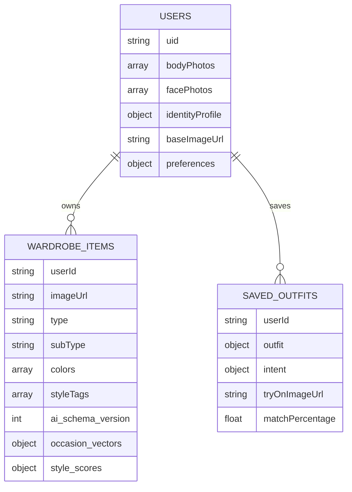

#### `users/{uid}`

| Field Group | Fields |
|-------------|--------|
| Profile | `displayName`, `email`, `photoUrl`, `preferences` |
| Onboarding | `onboardingCompleted`, `bodyPhotos[]`, `facePhotos[]` |
| Identity AI | `identityProfile`, `identityVersion`, `identityCollageUrl`, `identityGeneratedAt` |
| Try-on | `baseImageUrl`, `baseImageGeneratedAt` |

#### `wardrobe_items/{itemId}`

- Scoped by `userId` field (top-level collection, not subcollection)
- Query: `where('userId', == uid).orderBy('createdAt', descending)`
- Contains flattened AI metadata v2 fields

#### `saved_outfits/{outfitId}`

- Nested `outfit` (`GeneratedOutfit`) and `intent` (`OutfitIntent`)
- Denormalized tags for filtering: `colors`, `styleTags`, `occasion`, `season`
- Engagement: `viewCount`, `lastViewedAt`, `isFavorite`

### Firebase Storage Layout

```
users/{uid}/
├── photos/
│   ├── body_{timestamp}.jpg
│   └── face_{timestamp}.jpg
├── wardrobe/
│   └── item_{timestamp}.jpg          # Original garment photos
├── identity_collage_{timestamp}.jpg  # Analysis input
├── base_image_{timestamp}.jpg        # AI-generated try-on mannequin
└── outfits/
    └── tryon_{timestamp}.jpg         # Virtual try-on outputs
```

**Security:** Storage rules enforce `request.auth.uid == userId` on all paths.

### AI Orchestration Layer Map

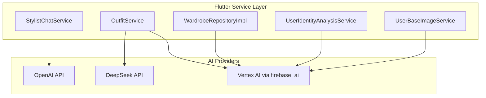

### Caching Architecture

| Cache | Scope | Key | Invalidation |
|-------|-------|-----|--------------|
| `ImageByteCache` | App singleton | Image URL | Manual `clear()` (not wired to logout today) |
| `OutfitService._cachedTryOnContext` | Service instance | `userId` | New service instance |
| Firestore `baseImageUrl` | Persistent | User doc | Regenerated on demand |
| Firestore `identityProfile` | Persistent | User doc | Regenerated when collage re-uploaded |

### Scalability Considerations

| Dimension | Current State | Scale Path |
|-----------|---------------|------------|
| **Firestore reads** | Full wardrobe load per generation | Pagination, indexed filters, edge cache |
| **AI calls** | Client-initiated | Move orchestration to Cloud Functions / Cloud Run |
| **Storage** | Per-user path isolation | Lifecycle rules for old try-ons |
| **Concurrent users** | Limited by client-side API keys | Server-side proxy, rate limiting, quota pools |

### Cost Optimization

1. **Skip DeepSeek** when chat supplies `precomputedIntent`
2. **Cap wardrobe items** sent to Gemini (10/type, 12 images)
3. **Compress before multimodal** — smaller payloads, faster inference
4. **Lazy try-on** — image generation only on demand
5. **Cache identity/base** — one-time expensive identity ops

### Future Cloud Evolution

- Server-side orchestration (Genkit sample exists in `functions/`)
- Vertex AI quota management per environment
- Dedicated vector index for semantic retrieval
- CDN for try-on and wardrobe thumbnails

---

## 10. Key Technical Differentiators

AIFit is not a wrapper around a single LLM API. The platform's defensible technical moat combines **fashion domain modeling**, **multimodal orchestration**, and **production performance engineering**.

### 1. Semantic Wardrobe Intelligence

Every garment becomes a **fashion knowledge node** with 15+ hidden semantic dimensions—not just tags. Schema v2 metadata powers both deterministic scoring and multimodal context.

### 2. AI-Enriched Clothing Metadata at Ingest

Analysis runs **once at upload** (Gemini 2.5 Flash, JSON mode) and persists to Firestore. All future outfit generations amortize this cost—wardrobe intelligence compounds over time.

### 3. Multimodal AI Orchestration

Five distinct AI invocation patterns (chat, intent, wardrobe analysis, outfit compose, try-on) coordinated by `OutfitService` with fallbacks and skip logic—**production-grade orchestration**, not prompt chaining.

### 4. Personalized Identity-Aware Try-On

`identityProfile` + `baseImageUrl` + `IdentityConsistencyPrompt` create a **three-layer identity stack** (analysis → base model → per-outfit) that generic VTON APIs do not provide out of the box.

### 5. Hybrid AI + Algorithmic Ranking

Local `WardrobeSearchAlgorithm` + `WardrobeMetadataScorer` deliver **sub-100ms filtering** with explainable scores—reducing Gemini input by up to 90% vs naive full-wardrobe prompts.

### 6. Progressive AI UX (P1)

Users receive **ranked outfits immediately**; try-on generates asynchronously per card. This architectural choice makes the product feel instant despite multi-model latency.

### 7. Cloud-Native Persistence Model

Firestore `aifitdbex` + Storage path conventions + security rules form a **multi-tenant, owner-isolated** data plane ready for server-side migration without schema redesign.

### 8. AI-Ready Asset Pipeline

On-the-fly compression (768px / Q82) with session byte caching ensures **every multimodal request sends optimal payloads** without storing duplicate assets.

### 9. Personalized Fashion Reasoning

`OutfitSemanticTargets` bridge conversational intent (GPT) to wardrobe metadata (occasion vectors, aesthetics, formality)—enabling **consistent reasoning** from chat to composition.

### Competitive Positioning Matrix

| Capability | Catalog Stylists | Rule-Based Apps | AIFit |
|------------|------------------|-----------------|-------|
| Uses owned wardrobe | ❌ | ⚠️ Limited | ✅ |
| Multimodal garment understanding | ❌ | ❌ | ✅ |
| Hidden semantic metadata | ❌ | ❌ | ✅ v2 |
| Multi-model orchestration | ⚠️ | ❌ | ✅ |
| Identity-aware try-on | ❌ | ❌ | ✅ |
| Sub-second pre-filter | N/A | ⚠️ | ✅ |
| Progressive try-on UX | ❌ | ❌ | ✅ |

---

## 11. Future Roadmap

### Near-Term Engineering

| Initiative | Technical Approach | Benefit |
|------------|-------------------|---------|
| **Transparent garment assets** | Background removal at ingest; alpha PNG Storage path | Cleaner try-on compositing |
| **Persisted AI-ready assets** | Store 768px JPEG alongside original at upload | Eliminate per-session recompression |
| **Cache lifecycle hooks** | `ImageByteCache.clear()` on logout / wardrobe refresh | Bounded memory |
| **Server-side orchestration** | Cloud Functions + Genkit; API keys off client | Security + quota control |

### Medium-Term AI Platform

| Initiative | Technical Approach | Benefit |
|------------|-------------------|---------|
| **Vector embeddings** | Embed `WardrobeAiMetadata` + image embeddings in Vertex Vector Search | Semantic "find similar" and faster retrieval |
| **Semantic retrieval** | Replace full wardrobe scan with ANN query on intent embedding | O(log n) vs O(n) scaling |
| **Advanced VTON** | Dedicated try-on model (IDM-VTON, OOTDiffusion) behind Cloud Run | Higher garment fidelity |
| **AI recommendation memory** | `saved_outfits` engagement → preference model | Personalized re-ranking |

### Long-Term Personalization Evolution

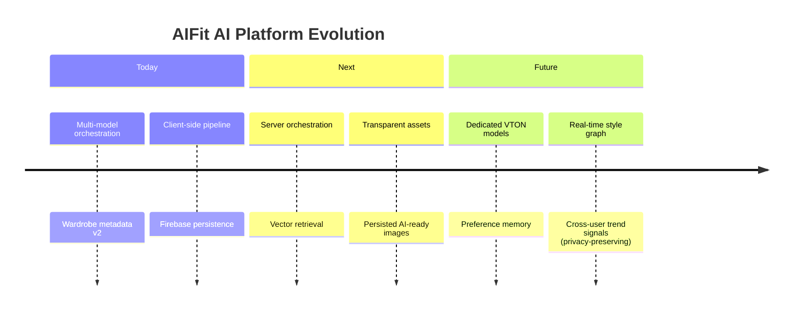

### Architectural Principles for Roadmap

1. **Preserve the phase contract** — intent → filter → compose → visualize remains the backbone.
2. **Move compute toward cloud, keep semantics on-device optional** — edge compression may remain for bandwidth.
3. **Embeddings augment, not replace, metadata v2** — structured fashion vectors remain interpretable.
4. **Identity is a first-class data object** — every VTON improvement builds on `identityProfile`.

---

## Appendix A — Service Index

| Service | Path | Role |
|---------|------|------|
| `OutfitService` | `lib/features/outfit/services/outfit_service.dart` | Pipeline orchestrator |
| `OutfitIntentAnalyzer` | `lib/features/outfit/services/outfit_intent_analyzer.dart` | Phase 1 intent |
| `WardrobeSearchAlgorithm` | `lib/features/outfit/services/wardrobe_search_algorithm.dart` | Phase 2 filter/rank |
| `WardrobeMetadataScorer` | `lib/features/outfit/services/wardrobe_metadata_scorer.dart` | Metadata boost |
| `OutfitGeneratorService` | `lib/features/outfit/services/outfit_generator_service.dart` | Phase 3 multimodal |
| `VirtualTryOnService` | `lib/features/outfit/services/virtual_try_on_service.dart` | Phase 4 image gen |
| `StylistChatService` | `lib/features/stylist/services/stylist_chat_service.dart` | GPT chat |
| `FirebaseAIServiceImpl` | `lib/core/services/firebase_ai_service_impl.dart` | Vertex AI gateway |
| `DeepSeekService` | `lib/core/services/deepseek_service.dart` | DeepSeek REST |
| `ImageByteCache` | `lib/core/services/image_byte_cache.dart` | Session byte cache |
| `ConcurrentTaskPool` | `lib/core/utils/concurrent_task_pool.dart` | Parallel downloads |
| `UserIdentityAnalysisService` | `lib/features/profile/services/user_identity_analysis_service.dart` | Identity JSON |
| `UserBaseImageService` | `lib/features/outfit/services/user_base_image_service.dart` | Base model image |
| `WardrobeRepositoryImpl` | `lib/features/wardrobe/data/wardrobe_repository_impl.dart` | Ingest + enrichment |

## Appendix B — Typical Latency Budget (Indicative)

| Stage | Typical Duration |
|-------|------------------|
| GPT chat turn | 1–3s |
| DeepSeek intent (when used) | 1–2s |
| Wardrobe filter | <100ms |
| Gemini outfit generation | 3–8s |
| Gemini try-on (per outfit) | 10–25s |
| **User-visible outfits** | **~5–12s** (Phases 1–3) |
| **User-visible try-on** | **+10–25s** (Phase 4, progressive) |

---

*This document reflects the production architecture as implemented in the AIFit codebase. For implementation changes, update this document in the same PR as architectural modifications.*
